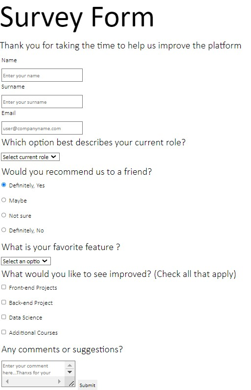

# Survey_Form  
  
## Description

- My very first html project for understanding HTML forms. 

### At the end of the project, following topics are to be covered;

- HTML     

### At the end of the project, students will be able to;

- improve coding skills within HTML 

- use git commands (push, pull, commit, add etc.) and Github as Version Control System.

### Project Link 

You can reach from [here](https://esadakman.github.io/html-survey-form/)

 ### Preview of the Project

